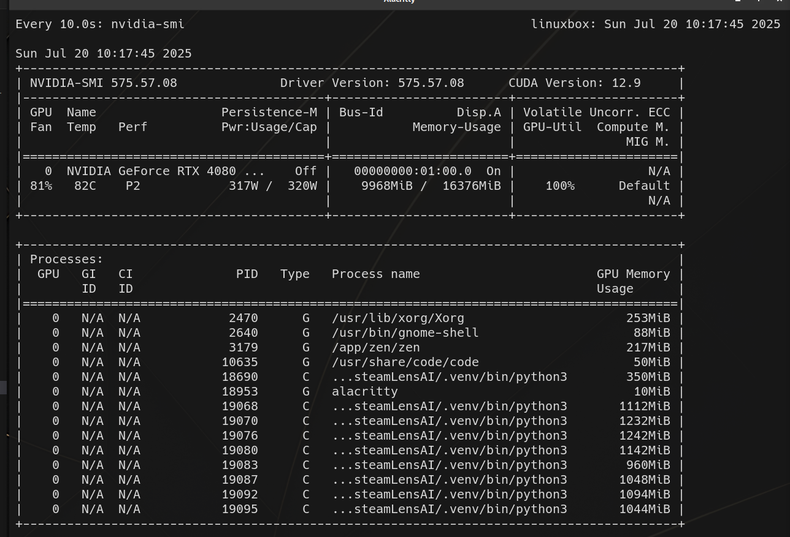
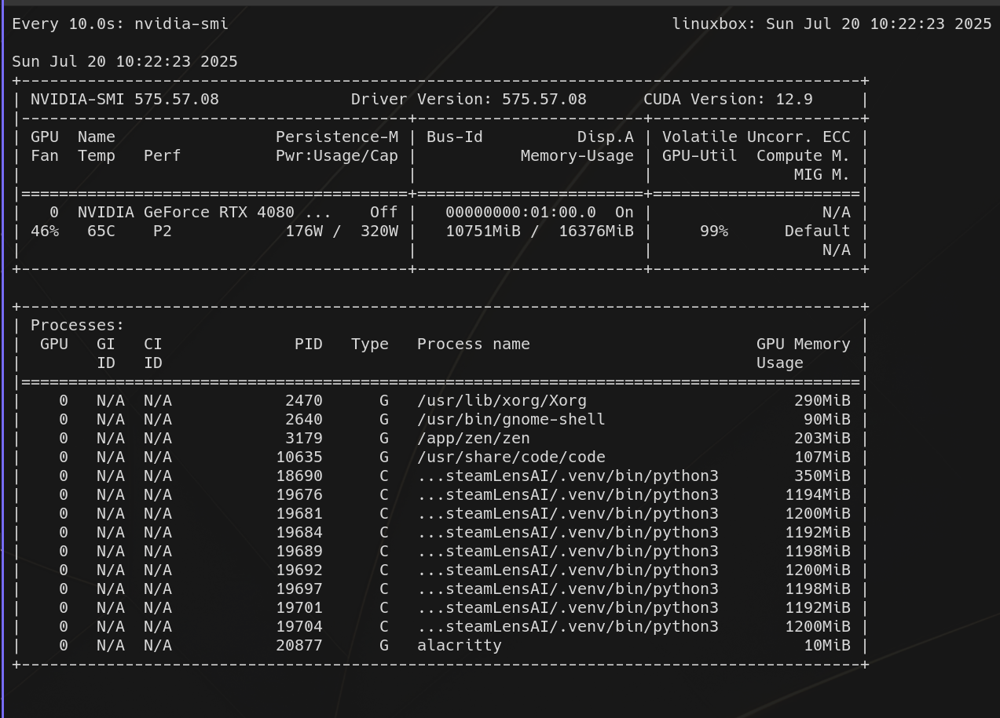
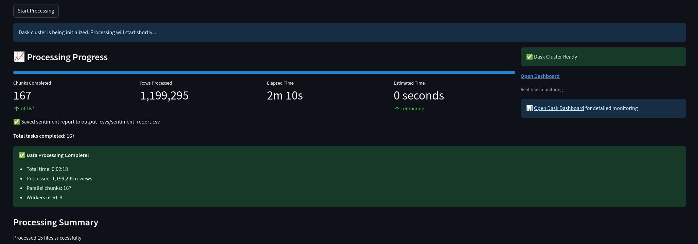
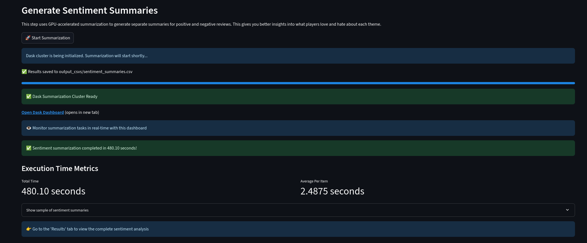
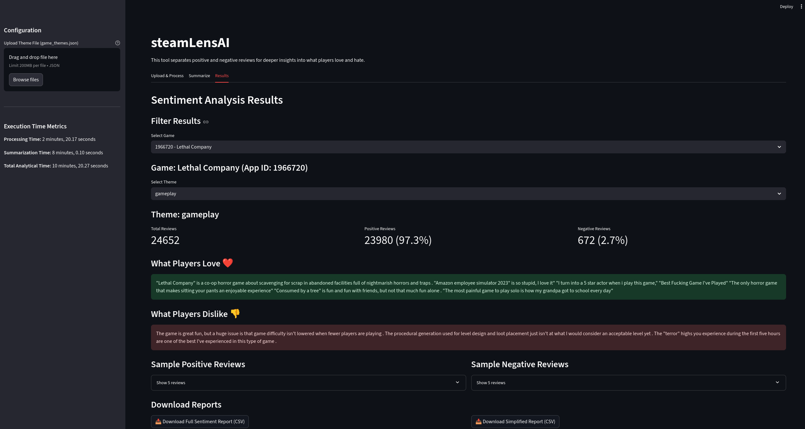

```
 ╔═══════════════════════════════════════════════════════════════════════════════════════════╗
 ║ ███████╗████████╗███████╗ █████╗  ███╗ ███╗ ██╗     ███████╗███╗   ██╗███████╗ █████╗ ██╗ ║
 ║ ██╔════╝╚══██╔══╝██╔════╝██╔══██╗████╗ ████║██║     ██╔════╝████╗  ██║██╔════╝██╔══██╗██║ ║
 ║ ███████╗   ██║   █████╗  ███████║██╔████╔██║██║     █████╗  ██╔██╗ ██║███████╗███████║██║ ║
 ║ ╚════██║   ██║   ██╔══╝  ██╔══██║██║╚██╔╝██║██║     ██╔══╝  ██║╚██╗██║╚════██║██╔══██║██║ ║
 ║ ███████║   ██║   ███████╗██║  ██║██║ ╚═╝ ██║███████╗███████╗██║ ╚████║███████║██║  ██║██║ ║
 ║ ╚══════╝   ╚═╝   ╚══════╝╚═╝ ╚═╝ ╚═╝    ╚═╝╚══════╝ ╚══════╝╚═╝  ╚═══╝╚══════╝╚═╝  ╚═╝╚═╝ ║
 ╚═══════════════════════════════════════════════════════════════════════════════════════════╝
```
since 90% of you are here to see the architecture, here it is...
# steamLensAI Architecture Documentation

This document explains the technical architecture, distributed processing design, and engineering decisions behind steamLensAI's high-performance Steam review analysis system.

## Architecture Overview

steamLensAI is built as a **distributed processing pipeline** that leverages parallel computing and GPU acceleration to analyze large volumes of Steam reviews efficiently.
Topic Assignment using seed-values (Theme based categorization) and sentence-transformers
 > 1.2M reviews in 2 minutes, 30 seconds

Summarization (Heirarchical Summarization) based on the now categorized data from the previous step:
 > 1.2M reviews in 8 minutes

The following are the Execution Time Metrics for the above mentioned data:


The core innovation lies in its **distributed computing approach** where multiple worker processes share a single GPU through intelligent model distribution, achieving maximum hardware utilization while maintaining processing efficiency.

```
┌──────────────────┐    ┌─────────────────────┐
│  Distributed     │───▶│   Summarization     │
│  Processing      │    │   Pipeline          │
│  (process_files) │    │   (summarization)   │
└──────────────────┘    └─────────────────────┘
         │                         │
         ▼                         ▼
┌─────────────────────────────────────────────┐
│           Dask LocalCluster                 │
│                                             │
│  Multiple Workers → Single GPU Sharing      │
│  • Model Distribution via publish_dataset   │
│  • Coordinated GPU Memory Management        │
│  • Parallel Processing with Shared Models   │
└─────────────────────────────────────────────┘
```

## Core Components
### 0. Models Used
#### Sentence Transformer Model
- **Model**: `all-MiniLM-L6-v2`
- **Purpose**: Converting review text to numerical embeddings for semantic similarity matching
- **Task**: Topic assignment and theme categorization
- **Provider**: Sentence Transformers library

#### Summarization Model
- **Model**: `sshleifer/distilbart-cnn-12-6`
- **Purpose**: Generating concise summaries of positive and negative reviews
- **Task**: Hierarchical text summarization with sentiment separation
- **Provider**: Hugging Face Transformers (DistilBART variant)

Both models support GPU acceleration and are distributed across multiple workers using Dask's `publish_dataset()` mechanism for efficient parallel processing.

### 1. **Distributed Processing Engine** (`processing/process_files.py`)
- **Role**: Multi-worker data processing coordination
- **Key Technologies**: Dask + LocalCluster + Sentence Transformers
- **Distributed Computing Features**:
  - Creates LocalCluster with multiple worker processes (Lighter than using mini-kubes)
  - Distributes the transformer model () across workers using `publish_dataset()`
  - Coordinates parallel processing of review chunks
  - Manages shared GPU resources across workers
  - Handles worker-to-worker communication and synchronization

### 2. **Topic Assignment Module** (`processing/topic_assignment.py`)
- **Role**: ML-powered review categorization on distributed workers
- **Key Technologies**: Sentence Transformers + Semantic Similarity
- **Worker-Level Responsibilities**:
  - Retrieves published models from worker dataset storage
  - Converts review text to numerical embeddings using shared GPU
  - Performs semantic similarity matching against game themes
  - Processes data chunks independently across multiple workers

### 3. **Summarization Pipeline** (`processing/summarization.py` + `summarize_processor.py`)
- **Role**: Distributed text summarization across workers
- **Key Technologies**: Transformers (DistilBART) + Multi-Worker GPU Processing
- **Distributed Features**:
  - Sets up dedicated Dask cluster for summarization tasks
  - Distributes summarization models to all workers via dataset publishing
  - Coordinates hierarchical summarization across worker processes
  - Manages GPU memory sharing for multiple model instances
  - Aggregates results from parallel summarization workers

## Data Flow Architecture

### Phase 1: File Processing & Validation
```
Uploaded Files → Temporary Storage → App ID Extraction → Theme Validation
     │                │                    │                  │
     ▼                ▼                    ▼                  ▼
 [file1.parquet]  [/tmp/uuid/]      [extract_appid()]   [themes.json]
 [file2.parquet]      ...              [12345, 67890]      [lookup]
 [file3.parquet]                           ...              [✓/✗]
```

### Phase 2: Distributed Processing Architecture
```
┌─────────────────┐
│   Main Process  │
│                 │
│ 1. Load Files   │──┐
│ 2. Combine Data │  │
│ 3. Create Chunks│  │
│ 4. Setup Dask   │  │
└─────────────────┘  │
                     │
                     ▼
┌─────────────────────────────────────────────────────────────┐
│                 Dask LocalCluster                           │
│                                                             │
│  ┌─────────────┐ ┌─────────────┐ ┌─────────────┐ ┌─────────────┐
│  │  Worker 1   │ │  Worker 2   │ │  Worker 3   │ │  Worker 4   │
│  │             │ │             │ │             │ │             │
│  │ • Get Model │ │ • Get Model │ │ • Get Model │ │ • Get Model │
│  │ • Process   │ │ • Process   │ │ • Process   │ │ • Process   │
│  │   Chunk A   │ │   Chunk B   │ │   Chunk C   │ │   Chunk D   │
│  │ • Save      │ │ • Save      │ │ • Save      │ │ • Save      │
│  │   Results   │ │   Results   │ │   Results   │ │   Results   │
│  └─────────────┘ └─────────────┘ └─────────────┘ └─────────────┘
│                                  │                      │
└──────────────────────────────────┼──────────────────────┘
                                   │
                                   ▼
                            ┌─────────────┐
                            │  RTX 4080   │
                            │   16GB GPU  │
                            │             │
                            │ • 4 Model   │
                            │   Copies    │
                            │ • Shared    │
                            │   Compute   │
                            └─────────────┘
```

### Phase 3: Result Aggregation
```
Temporary Files → Aggregation → Final Report → CSV Export
     │               │             │            │
     ▼               ▼             ▼            ▼
┌─────────────┐ ┌─────────────┐ ┌───────────┐ ┌──────────┐
│ /tmp/       │ │ Combine     │ │ Structured│ │ Download │
│ • pos_revs/ │→│ • Count     │→│ DataFrame │→│ CSV File │
│ • neg_revs/ │ │ • Merge     │ │ • Metrics │ │          │
│ • agg_data/ │ │ • Calculate │ │ • Reviews │ │          │
└─────────────┘ └─────────────┘ └───────────┘ └──────────┘
```

## Performance Optimizations

### 1. **GPU Model Distribution Strategy**
**Challenge**: Distribute ML models to multiple workers on single GPU

**The Serialization Problem**:
Imagine you have a recipe book (ML model) and you try to tear out individual pages to give different pages to different chefs (workers). The problem is that recipes are interconnected - Chef A gets page 5 (which says "add the mixture from step 3"), but Chef B has page 3 (which explains what "the mixture" is). Neither chef can cook properly because they only have fragments of the complete recipe.

**Technical Details**:
- **Dask.scatter() Fragmentation**: Traditional scatter tries to break models into pieces and distribute fragments
- **Model Interconnectedness**: ML model layers reference each other, weights depend on other weights
- **Incomplete Models Fail**: Workers receiving fragmented models cannot perform inference
- **Models Need Integrity**: Each worker requires the complete, intact model to function

```python
# This FAILS - Cannot serialize CUDA tensors
model = SentenceTransformer('model', device='cuda')  # Model on GPU
client.scatter(model)  # ERROR: Cannot serialize CUDA tensors!
```

**Solution**: CPU-Serialize-GPU pattern
```python
# Step 1: "Translate" the recipe book to common language (move to CPU)
model.to('cpu')                              # Move model to CPU memory
for param in model.parameters():
    param.data = param.data.cpu()           # Ensure ALL components are on CPU

# Step 2: "Photocopy and distribute" (serialize and send to workers)
client.publish_dataset(model, name='model') # Successfully distribute CPU model

# Step 3: Each kitchen "translates back" (workers move to GPU)
# In each worker:
worker_model = get_dataset('model')          # Get CPU copy
worker_model.to('cuda')                      # Move to shared GPU
# Result: 4 model instances on 1 GPU (efficient memory sharing)
```

**Why This Works**:
- CPU models are just arrays of numbers (easily serializable)
- Each worker gets its own independent copy of the model
- Workers can move their copies to GPU without conflicts
- Multiple model instances can coexist on the same GPU efficiently

### 2. **Optimal Chunk Sizing**
Previously handled inefficienty (pre commit 90) the whole dataset was given to the workers causing memory  issues, now handled with chunking instead.
**Hardware-Aware Configuration**:
```python
# System: RTX 4080 Super (16GB VRAM) + Ryzen 7700X + 32GB RAM
PROCESSING_CONFIG = {
    'chunk_size': 700,        # Optimized for GPU batch processing
    'n_workers': 8,             # Leave 2 cores for system
    'memory_per_worker': '4GB', # 24GB total (8GB system reserve)
    'gpu_batch_size': 512,      # Maximum GPU utilization
}
```

### 3. **Memory Management Strategy**
```python
# Aggressive cleanup to prevent memory leaks
del large_dataframe
gc.collect()                    # Force garbage collection
torch.cuda.empty_cache()       # Clear GPU memory
```

## Design Patterns

### 1. **Producer-Consumer with Dask Delayed**
```python
# Producer: Create work items (lazy evaluation)
tasks = [delayed(process_chunk)(chunk) for chunk in chunks]

# Consumer: Execute and collect results
results = client.compute(tasks)
```

### 2. **Temporary Storage Pattern**
```python
# Intermediate results stored in structured temp directories
temp_structure = {
    'base': '/tmp/steamlens_temp_123/',
    'aggregations': 'aggregations/',     # Count data
    'positive_reviews': 'positive_reviews/', # Positive review text
    'negative_reviews': 'negative_reviews/', # Negative review text
}
```

### 3. **Progress Monitoring with Futures**
```python
# Non-blocking progress tracking
for future in as_completed(futures):
    result = future.result()
    update_progress_display(completed, total)
    log_performance_metrics(result)
```

## GPU Resource Management

### Multi-Worker Single-GPU Architecture
This system uses an **unconventional but efficient** approach for GPU utilization:

```python
# Standard Industry Approach:
1 GPU = 1 Worker = 1 Model Instance

# steamLensAI Approach:
1 GPU = 4 Workers = 4 Model Instances (shared GPU memory)
```

**Benefits**:
- 100% GPU utilization through intelligent resource sharing
- Memory efficient (shared model weights across workers)
- Maximum performance extraction from single GPU hardware

**Why This Works**:
- PyTorch handles concurrent GPU access efficiently
- Modern GPUs (RTX 4080) have sufficient memory bandwidth for multiple models
- Batch processing workloads tolerate occasional synchronization overhead

## System Requirements

### Hardware Requirements
```yaml
GPU: CUDA-capable GPU
Other: All other specifications configurable via app_config.py
```

### Performance Scaling
```python
# Observed throughput:
1. 1.2M reviews in 2:19 = ~8,633 reviews/second
1. 1.2M reviews in 8:02 = ~2,489 reviews/second
# Scaling characteristics:
- CPU-bound: Linear scaling with cores (up to ~8 cores for my computer)
- GPU-bound: Linear scaling with cores (I can hold at most 12 workers at a time in my GPU but the GPU hits 100% at 8 workers)
- I/O-bound: Depends on storage speed (biggest challenge as chunking requires multiple IO reads which can't be parallelized)
```
The followin are terminal images showing multiple models being loaded in the GPU at the same time:


## Configuration Management

### Hardware-Adaptive Configuration
The system automatically detects hardware and adjusts processing parameters:

```python
# config/app_config.py
if SYSTEM_MEMORY_GB >= 32 and GPU_MEMORY_GB >= 16:
    PROCESSING_CONFIG = {
        'n_workers': 6,              # More workers for high-end system
        'memory_per_worker': '4GB',  # Higher memory per worker  
        'gpu_batch_size': 512,       # Larger batches for 16GB VRAM
        'chunk_size': 25000,         # Larger chunks for efficiency
    }
elif SYSTEM_MEMORY_GB >= 16:
    # Mid-range configuration
    PROCESSING_CONFIG = { ... }
else:
    # Low-memory configuration  
    PROCESSING_CONFIG = { ... }
```

## Monitoring & Observability

### Built-in Monitoring
- **Dask Dashboard**: Real-time worker and task monitoring
- **Progress Tracking**: Chunk-level completion monitoring  
- **Performance Metrics**: Throughput and timing statistics
- **Resource Usage**: Memory and GPU utilization tracking

### Debugging Features
- **Unique Chunk IDs**: Granular task tracking and error isolation
- **Timing Metrics**: Phase-by-phase performance analysis
- **Error Handling**: Graceful failure recovery and reporting

---
## Outputs:



## Results:
The following is the results page:


## Key Engineering Decisions

| Decision | Reasoning | Trade-offs |
|----------|-----------|------------|
| **Dask over Ray** | Simpler setup(idk ray, will try it out tho), better Pandas integration | Less GPU-native features |
| **Single-GPU Multi-Worker** | Maximum hardware utilization | Complex memory management |
| **Temporary File Storage** | Fault tolerance, progress tracking | Disk space usage |
| **CPU Model Distribution** | Avoid GPU serialization issues | Extra CPU↔GPU transfers |

This architecture prioritizes **maximum performance** from limited hardware over traditional scalability patterns, making it ideal for research, prototyping, and resource-constrained environments.