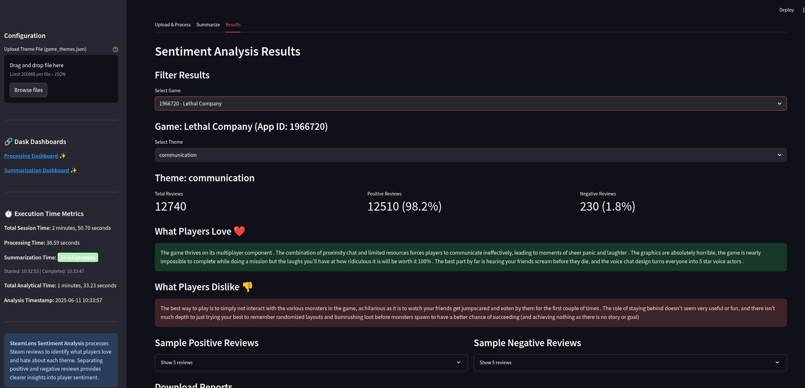

```
 ╔═══════════════════════════════════════════════════════════════════════════════════════════╗
 ║ ███████╗████████╗███████╗ █████╗  ███╗ ███╗ ██╗     ███████╗███╗   ██╗███████╗ █████╗ ██╗ ║
 ║ ██╔════╝╚══██╔══╝██╔════╝██╔══██╗████╗ ████║██║     ██╔════╝████╗  ██║██╔════╝██╔══██╗██║ ║
 ║ ███████╗   ██║   █████╗  ███████║██╔████╔██║██║     █████╗  ██╔██╗ ██║███████╗███████║██║ ║
 ║ ╚════██║   ██║   ██╔══╝  ██╔══██║██║╚██╔╝██║██║     ██╔══╝  ██║╚██╗██║╚════██║██╔══██║██║ ║
 ║ ███████║   ██║   ███████╗██║  ██║██║ ╚═╝ ██║███████╗███████╗██║ ╚████║███████║██║  ██║██║ ║
 ║ ╚══════╝   ╚═╝   ╚══════╝╚═╝ ╚═╝ ╚═╝    ╚═╝╚══════╝ ╚══════╝╚═╝  ╚═══╝╚══════╝╚═╝  ╚═╝╚═╝ ║
 ╚═══════════════════════════════════════════════════════════════════════════════════════════╝
```

# 🎮 SteamLens: Advanced Sentiment Analysis for Steam Reviews

SteamLens is a powerful, GPU-accelerated sentiment analysis and summarization tool designed for large-scale Steam game review processing. It uses distributed computing and advanced NLP techniques to separate positive and negative reviews, providing meaningful insights into what players love and hate about different game themes.

## ✨ Key Features

- **Sentiment Separation**: Automatically separates positive and negative reviews for deeper insights
- **GPU-Accelerated Processing**: Optimized for high-performance hardware with CUDA support
- **Distributed Computing**: Uses Dask for scalable, parallel processing across multiple workers
- **Interactive Web Interface**: Built with Streamlit for easy use and real-time monitoring
- **Theme-Based Analysis**: Maps reviews to specific game themes using semantic similarity
- **Hierarchical Summarization**: Generates concise summaries for both positive and negative sentiment
- **Real-time Monitoring**: Integrated Dask dashboards for process monitoring
- **Memory Efficient**: Dynamic resource allocation and optimized memory management

## 🏗️ Architecture Overview

### Core Components

1. **Data Processing Pipeline** (`processing/process_files.py`)
   - Handles large-scale parquet file processing using Dask
   - Dynamic resource allocation based on system capabilities
   - Multi-worker processing with GPU acceleration
   - Real-time progress monitoring

2. **Topic Assignment** (`processing/topic_assignment.py`)
   - Semantic similarity matching using Sentence Transformers
   - GPU-accelerated embedding computation
   - Efficient cosine similarity calculations

3. **Sentiment Summarization** (`processing/summarization.py`)
   - GPU-optimized batch processing for review summarization
   - Hierarchical summarization for large review sets
   - Configurable summary length and quality parameters

4. **Orchestration Layer** (`processing/summarize_processor.py`)
   - Hardware-aware resource allocation
   - Dynamic worker scaling based on GPU availability
   - Robust error handling and fallback mechanisms

5. **Web Interface** (`ui/`)
   - Streamlit-based user interface with tabbed navigation
   - File upload, processing monitoring, and results visualization
   - Interactive filtering and data exploration

## 📋 Requirements

### System Requirements
- **Python**: >= 3.8
- **Memory**: Minimum 8GB RAM (16GB+ recommended for large datasets)
- **GPU**: CUDA-compatible GPU recommended for optimal performance
- **Storage**: Sufficient space for parquet files and output data

### Dependencies
```
streamlit>=1.28.0
pandas>=1.5.3
numpy>=1.24.3
dask[distributed]>=2023.10.1
pyarrow>=14.0.1
sentence-transformers>=2.2.2
transformers>=4.35.0
torch>=2.0.0
scikit-learn>=1.3.0
psutil>=5.9.0
tqdm>=4.66.1
```

## 🚀 Quick Start

### 1. Installation

```bash
# Clone the repository
git clone <repository-url>
cd steamLens

# Install dependencies
pip install -r requirements.txt
```

### 2. Prepare Your Data

1. **Steam Review Data**: Ensure your Steam review data is in Parquet format with these columns:
   - `steam_appid`: Steam application ID
   - `review`: Review text content
   - `review_language`: Language of the review
   - `voted_up`: Boolean indicating positive/negative sentiment
   - `name`: Game name (optional but recommended)

2. **Theme Dictionary**: Create a `game_themes.json` file mapping app IDs to themes:
```json
{
  "123456": {
    "Gameplay Mechanics": ["controls", "gameplay", "mechanics"],
    "Graphics & Visuals": ["graphics", "visuals", "art style"],
    "Story & Narrative": ["story", "plot", "characters"]
  }
}
```

### 3. Run the Application

```bash
streamlit run app.py
```

The application will open in your browser at `http://localhost:8501`

## 💻 Usage Guide

### Step 1: Upload & Process
1. Upload your `game_themes.json` file in the sidebar
2. Navigate to the "Upload & Process" tab
3. Upload one or more Parquet files containing Steam reviews
4. Click "🚀 Start Processing" to begin data processing

The system will:
- Validate files against the theme dictionary
- Filter for English reviews
- Assign topics using semantic similarity
- Separate positive and negative reviews
- Generate sentiment statistics

### Step 2: Summarize
1. Navigate to the "Summarize" tab
2. Click "🚀 Start Summarization" to generate AI summaries

The system will:
- Initialize GPU-optimized summarization cluster
- Generate separate summaries for positive and negative reviews
- Use hierarchical summarization for large review sets

### Step 3: Results
1. Navigate to the "Results" tab
2. Filter by game and theme to explore insights
3. View sentiment summaries and sample reviews
4. Download reports in CSV format

## ⚙️ Configuration

### Hardware Configuration
Edit `config/app_config.py` to adjust hardware settings:

```python
HARDWARE_CONFIG = {
    'worker_count': 6,              # Number of Dask workers
    'memory_per_worker': '3GB',     # Memory allocation per worker
    'gpu_batch_size': 96,           # GPU batch size for summarization
    'model_name': 'sshleifer/distilbart-cnn-12-6',  # Summarization model
    'chunk_size': 400,              # Review chunk size
    'max_summary_length': 300,      # Maximum summary length
    'min_summary_length': 80,       # Minimum summary length
    'num_beams': 4,                 # Beam search parameter
}
```

### Model Configuration
- **Embedding Model**: `all-MiniLM-L6-v2` (configurable in `app_config.py`)
- **Summarization Model**: `sshleifer/distilbart-cnn-12-6` (optimized for speed and quality)

## 📁 Project Structure

```
steamLens/
├── app.py                      # Main Streamlit application entry point
├── config/
│   └── app_config.py          # Configuration parameters and constants
├── processing/
│   ├── process_files.py       # Main file processing logic with Dask
│   ├── topic_assignment.py    # Semantic topic assignment
│   ├── summarization.py       # GPU-optimized summarization
│   └── summarize_processor.py # Summarization orchestration
├── ui/
│   ├── upload_tab.py          # File upload interface
│   ├── summarize_tab.py       # Summarization interface
│   ├── results_tab.py         # Results visualization
│   └── sidebar.py             # Configuration sidebar
├── data/
│   └── data_loader.py         # Data loading utilities
├── utils/
│   └── system_utils.py        # System resource detection
├── output_csvs/               # Generated reports (auto-created)
├── checkpoints/               # Processing checkpoints (auto-created)
├── requirements.txt           # Python dependencies
└── README.md                  # This file
```

## 🔧 Data Collection Pipeline (Optional)

For collecting your own Steam data, the repository includes collection scripts:

### Step 1: Get App IDs
```bash
python src/Step_1_collection_and_cleaning/getAppIds.py
```

### Step 2: Collect App Details and Reviews
```bash
python src/Step_1_collection_and_cleaning/getAppDetails.py
```

### Step 3: Convert to Parquet
```bash
python src/Step_2_parquet_conversion/dask_json_to_parquet.py
```

## 📊 Performance Optimization

### GPU Optimization
- **Automatic Detection**: System automatically detects and utilizes available GPUs
- **Memory Management**: Intelligent GPU memory cleanup to prevent OOM errors
- **Batch Processing**: Optimized batch sizes based on available VRAM

### CPU Optimization
- **Dynamic Workers**: Worker count automatically scaled based on CPU cores
- **Memory Allocation**: 70% of available RAM allocated to Dask workers
- **Parallel Processing**: Efficient parallelization across all available cores

### Memory Management
- **Streaming Processing**: Large datasets processed in chunks to manage memory
- **Automatic Cleanup**: Regular memory cleanup during processing
- **Resource Monitoring**: Real-time resource usage monitoring

## 🔍 Monitoring and Debugging

### Dask Dashboards
The application provides real-time monitoring through Dask dashboards:
- **Processing Dashboard**: Monitor file processing and topic assignment
- **Summarization Dashboard**: Track summarization progress and resource usage

### Logging and Progress
- Real-time progress bars for all major operations
- Detailed timing metrics in the sidebar
- Comprehensive error handling with informative messages

## 📈 Scaling Considerations

### Dataset Size
- **Small** (< 1GB): Single worker processing
- **Medium** (1-10GB): Multi-worker processing with moderate batch sizes
- **Large** (> 10GB): Full parallel processing with optimized batch sizes

### Hardware Scaling
- **CPU-only**: Up to 4 workers with larger memory allocation
- **GPU-enabled**: Up to 6 workers with GPU acceleration
- **High-memory systems**: Automatic scaling based on available RAM

## 🤝 Contributing

1. Fork the repository
2. Create a feature branch (`git checkout -b feature/amazing-feature`)
3. Commit your changes (`git commit -m 'Add amazing feature'`)
4. Push to the branch (`git push origin feature/amazing-feature`)
5. Open a Pull Request

## 📝 License

This project is licensed under the MIT License - see the LICENSE file for details.

## 🙏 Acknowledgments

- **Streamlit**: For the excellent web application framework
- **Dask**: For distributed computing capabilities
- **Sentence Transformers**: For semantic similarity analysis
- **Transformers**: For state-of-the-art summarization models
- **Steam**: For providing accessible review data

## 📞 Support

If you encounter issues or have questions:
1. Check the troubleshooting section in the documentation
2. Review the error messages and logs
3. Ensure your system meets the minimum requirements
4. Open an issue on GitHub with detailed information about your setup and the problem

---

**Built with ❤️ for better understanding of player sentiment in gaming**
